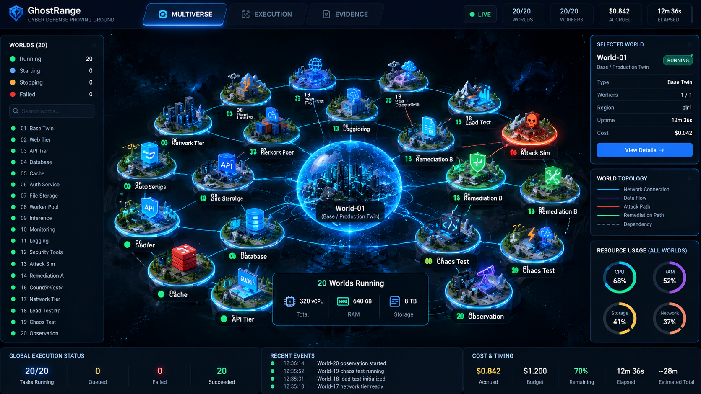
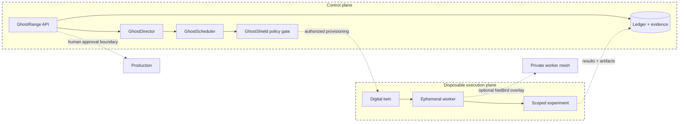
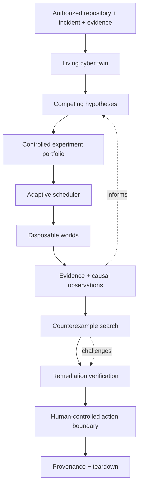
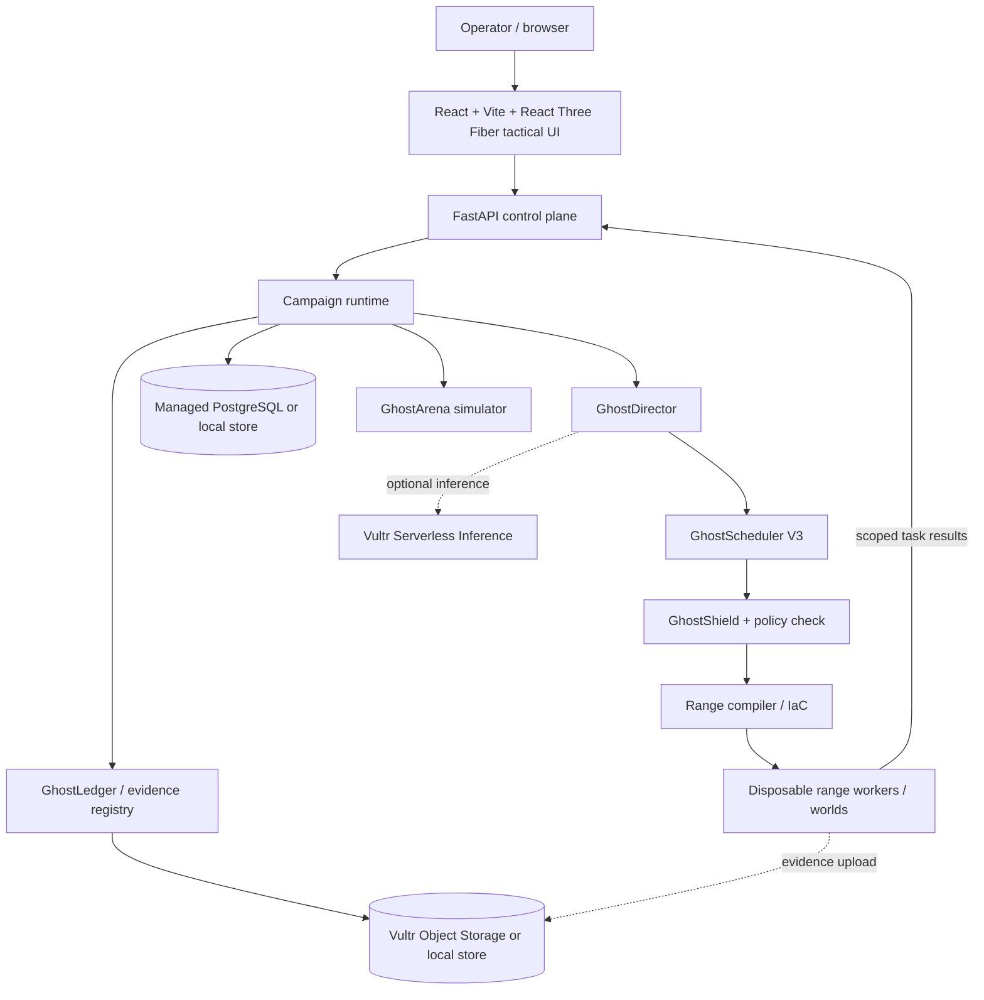
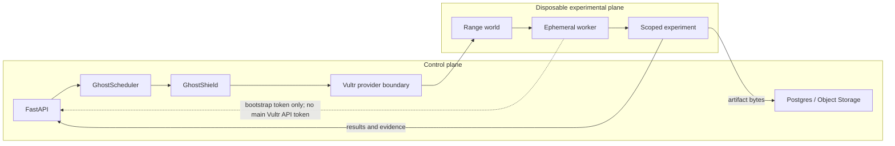
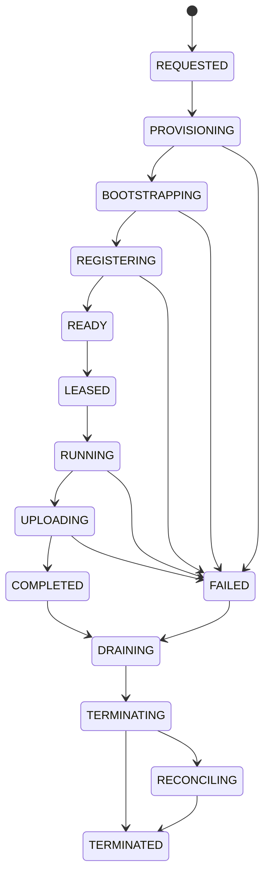
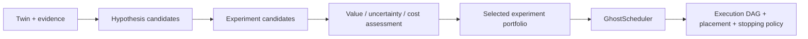
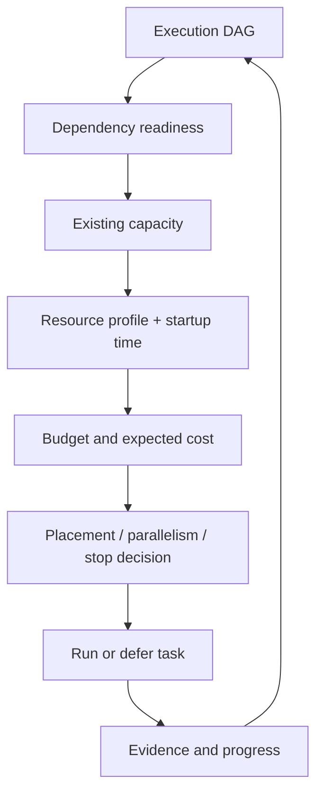

# GhostRange

**Autonomous cyber investigation through disposable digital twins, controlled experiments, adaptive compute, and evidence-grounded verification.**

GhostRange is a research prototype for investigating an authorized system without turning a model-generated explanation into an operational change. It compiles a range, forms competing hypotheses, plans experiments, records evidence and provenance, searches for counterexamples, and keeps consequential provider or production actions behind explicit policy and human-control boundaries.

| Try it | Status |
| --- | --- |
| [Live tactical UI](https://45.76.248.45.sslip.io/) (also [https://45-76-248-45.nip.io/](https://45-76-248-45.nip.io/) and plain [http://45.76.248.45/](http://45.76.248.45/)) | Reachable now; the two domain forms carry trusted HTTPS certificates. The deployed API is stale relative to this checkout, so use it for UI inspection rather than as proof of the current campaign API. |
| Reproducible local demo | `POST /v1/campaigns/golden` with the mock provider; verified campaign path, no billable workers. |
| Real infrastructure proof (this checkout, 2026-09-27) | A full Vultr Compute worker lifecycle (create → bootstrap → real CPU benchmark → Postgres artifact → teardown → confirmed-destroyed via direct Vultr GET) and 10 real concurrent Vultr Serverless Inference calls. See [M20 final status](docs/milestones/M20_FINAL.md). The golden campaign has not yet triggered a live worker as one integrated run — see the same doc for the single biggest remaining gap. |
| Source | [GitHub repository](https://github.com/chetas1208/GhostRange) |
| Maturity | `RESEARCH_PROTOTYPE` · M20 `NO-SHIP` |

GhostRange is not a generic pentesting agent, a vulnerability scanner, a SIEM, or a chatbot around security tools. Its core question is: **which explanation and remediation survive controlled testing, and what evidence supports that conclusion?**


*Multiverse tactical UI, illustrative multi-world state. The real infrastructure proof recorded so far (see the status table above) is a single real Vultr Compute worker end-to-end, not the 20-world count shown here — this image shows the UI's intended scale, not a claim about what has run live.*

## System architecture at a glance

The control plane plans and verifies work; the disposable execution plane performs only scoped experiments. Dashed boundaries and links mark isolated or optional paths, including the currently opt-in NetBird worker overlay.



## Table of contents

- [The problem](#the-problem)
- [The gap](#the-gap)
- [The core idea](#the-core-idea)
- [How GhostRange works](#how-ghostranges-works)
- [Inputs and outputs](#inputs-and-outputs)
- [System architecture at a glance](#system-architecture-at-a-glance)
- [Architecture](#architecture)
- [The three interfaces](#the-three-interfaces)
- [Subsystems](#subsystems)
- [Cost and infrastructure](#cost-and-infrastructure)
- [Safety and trust boundaries](#safety-and-trust-boundaries)
- [Technology stack](#technology-stack)
- [Repository structure](#repository-structure)
- [Local development](#local-development)
- [Configuration](#configuration)
- [Testing and benchmarks](#testing-and-benchmarks)
- [Deployment](#deployment)
- [Research foundation](#research-foundation)
- [Current limitations and maturity](#current-limitations-and-maturity)
- [Contributing](#contributing)

## The problem

Security incidents are rarely hard because an engineer cannot produce one plausible explanation. They are hard because multiple explanations fit incomplete evidence.

An investigation may need to reconstruct system state, form hypotheses, provision test infrastructure, reproduce a condition, run controlled experiments, compare fixes, search for regressions, preserve evidence, control cost, clean up resources, and decide how much confidence is justified. In many organizations that workflow is spread across scanners, dashboards, cloud consoles, scripts, notebooks, and human memory.

GhostRange focuses on joining those steps into one auditable investigation loop. It does not treat a plausible model answer as proof.

## The gap

Many security tools are optimized for detection, alerting, scanning, telemetry queries, or predefined response. GhostRange is designed around the bridge that often remains fragmented across tool classes:

> **Detection says that something may be wrong. Experimental verification asks which explanation and remediation survive controlled testing.**

This is a workflow thesis, not a claim that no other product addresses any part of it.

## The core idea

Agents should not directly change production merely because an answer sounds convincing. They should work inside disposable, authorized worlds where proposed actions can be tested, challenged, measured, and torn down.



## How GhostRange works

The current canonical M20 campaign is implemented as a mock-first chain:

```mermaid
flowchart LR
    S[Compose range input] --> RC[Range compiler]
    RC --> T[Living-twin / range representation]
    T --> D[GhostDirector simulator]
    D --> H[Three cross-service hypotheses: billing / gateway / identity]
    H --> P[GhostScheduler V3 plan]
    P --> V[Adversarial verification: shallow fix falsified, deep fix survives]
    V --> L[GhostLedger seal + verification]
    L --> A[GhostArena simulated release report]
    A --> R[Campaign report + evidence bundle]
    R --> X[Optional live-worker step]
    X --> Q[Teardown / owned-worker reconciliation]
```



The mock path is the default and is the reproducible path used by the release checks. The live-worker branch is provider- and policy-gated; the current M20 evidence records it as not completed end-to-end.

## Inputs and outputs

### Inputs

- An authorized source or range description, currently demonstrated by the auth-lab Compose input.
- An incident description and optional logs, traces, alerts, or deployment configuration.
- Investigation constraints such as budget, worker limits, and production-action policy.
- Optional Vultr, PostgreSQL, Object Storage, Serverless Inference, and NetBird configuration for controlled live integrations.

### Outputs

Depending on the path and maturity level, GhostRange produces:

- structured hypotheses and experiment decisions;
- an execution plan and scheduler reasons;
- observations, adversarial counterexamples, and verification results;
- content-addressed evidence metadata and a ledger bundle digest;
- campaign, reproduction, cost, and resource-history records;
- Arena qualification output for the simulated evaluation path;
- explicit limitations and teardown/owned-worker state.

The output is not a universal production safety certificate. A successful experiment in a disposable twin is evidence about the tested conditions, not permission to change an unrelated production system.

## Architecture

### System architecture



### Control plane vs experimental data plane



The worker boundary is designed so a worker receives scoped bootstrap credentials rather than the control plane's main Vultr API token. The policy and provider adapters are tested locally; live compute execution remains gated and is not represented as complete in the current release.

### Worker lifecycle



### Director and scheduler split

GhostDirector answers **what should be tested**. GhostScheduler answers **how approved work should use compute**. Keeping those responsibilities separate makes decisions inspectable and lets scheduling remain deterministic even when inference is configured.





## The three interfaces

The tactical UI presents three operator surfaces:

| Surface | Purpose | Current state |
| --- | --- | --- |
| Multiverse | Twin topology, worlds, forks, attack/causal paths, and remediation branches | Implemented UI with fixture/live data-source paths; not proof of a live worker campaign. |
| Execution | DAG, workers, timers, cost, and lifecycle | Implemented UI and event reducers; live worker path remains gated. |
| Evidence | Claims, artifacts, provenance, ledger state, and verification | Implemented UI and evidence contracts; several upstream evaluators are simulated. |

The frontend intentionally labels `LIVE`, `SIMULATED`, and `HISTORY` states. Fixture replay is useful for development and demos but must not be described as live execution.

## Subsystems

| Subsystem | Role | Evidence-backed maturity |
| --- | --- | --- |
| GhostDirector | Selects hypotheses and experiments | Simulator and golden-path integration; not a production autonomous decision service. |
| GhostScheduler | Scores, places, parallelizes, and stops work | V3 package and plan-preview API; live compute placement is gated. |
| Range Compiler | Turns range descriptions into reproducible runtime inputs | Compose pipeline and local range compilation. |
| GhostRuntime | Wraps longer-running execution and worker processes | Package/API pieces exist; not fully orchestrated in one M20 HTTP call. |
| GhostCausal | SCM, intervention, counterfactual, and transport queries | Simulator and API transport; M20 status is simulated / NO-GO. |
| GhostShield | Authorizes consequential actions and provider calls | Policy enforcement and bypass tests; two separate real bypass gaps found and closed 2026-09-27 (an orchestrator path with zero gateway mediation, and an ownership-check no-op in `list_computes`) — see [the bypass analysis](docs/security/GHOSTSHIELD_BYPASS_ANALYSIS.md); not yet exercised against a golden-campaign-triggered live worker end-to-end. |
| GhostGate | Promotion contracts and approval boundary | API and contracts; production promotion is not a shipped capability. |
| GhostWatch | Rollout observation and conformance | Simulator and API; UI explicitly labels simulated rollout. |
| GhostLedger | Seals and verifies evidence bundles | Implemented seal/verification path and content-addressed evidence model. |
| GhostMesh | Federated evidence/knowledge harness | Five-node logical harness and API; live mesh is not run. |
| GhostEvolve | Experience and candidate promotion flow | Implemented gate-oriented package; NO-GO for production promotion. |
| GhostArena | Independent evaluation substrate | Hidden-scenario simulator and release report; not a live certification authority. |
| Inference worker pool | Concurrent Serverless Inference calls under caps | 10 real concurrent Vultr Serverless Inference calls verified 2026-09-27 (distinct request IDs, `max_observed_concurrency=10`, hard-capped at `MAX_ACTIVE_INFERENCE_WORKERS<=10` / `INFERENCE_WORKER_MAX_USD<=$25`); separate from live Vultr Compute workers, which have their own cap (`MAX_ACTIVE_COMPUTE_WORKERS<=1`). See the M20 reality matrix. |
| GitHub-repo-as-investigation-input | Derives a candidate system model from a public repository before anything is provisioned | Real heuristic scanner (docker-compose/Dockerfile/K8s/Terraform/OpenAPI detection) and intake screen exist and are tested; not yet wired into the live provisioning/campaign pipeline. |

## Cost and infrastructure

The control plane can use local services for development and Vultr services when explicitly configured:

| Service | Role | Default / current evidence |
| --- | --- | --- |
| Vultr Cloud Compute | Control VM and optional ephemeral workers | Control VM reachable; one full single-worker lifecycle (create/bootstrap/benchmark/artifact/teardown/confirmed-destroyed) proven live from the control VM 2026-09-27; a golden-campaign-triggered live worker as part of one integrated run is not yet proven (still blocked/failing — see the M20 reality matrix). |
| Managed PostgreSQL | Durable event and worker state | Controlled-live integration; local fallback is available. |
| Vultr Object Storage | Artifact bytes | Controlled-live integration; local store is available. |
| Serverless Inference | Optional model/inference calls | Smoke and concurrent worker-pool calls recorded as real-live in the M20 matrix when credentials are present. |
| NetBird | Optional worker mesh enrollment and segmentation | Wired into the live worker orchestrator behind `NETBIRD_ENABLED` (real code, tested); `NETBIRD_ENABLED=false` in production, so it has never enrolled a real peer. No live mesh claim. |

Cost controls are explicit settings and contracts, including maximum active workers, compute workers, worlds, experiment cost, campaign cost, worker lifetime, and inference-worker spend. Mock campaigns cost `$0` by design. Live compute can create billable resources and must be treated as an operator-controlled action.

## Safety and trust boundaries

GhostRange is safety-oriented, but this checkout is not production-certified. Important boundaries include:

- provider calls pass through a single Vultr control abstraction;
- live campaigns require explicit flags and credentials;
- workers are intended to receive scoped bootstrap credentials, not master provider keys;
- GhostShield and policy checks gate actions;
- ranges are authorized, disposable environments rather than production targets;
- evidence and decision records retain provenance and digests;
- teardown and reconciliation track owned resources;
- mock, simulated, controlled-live, and real-live paths are separate concepts in the code and UI.

Read [the execution policy](docs/security/EXECUTION_POLICY.md), [the production boundary](docs/security/PRODUCTION_BOUNDARY.md), [the threat model](docs/security/THREAT_MODEL.md), and [the GhostShield analysis](docs/security/GHOSTSHIELD_BYPASS_ANALYSIS.md) before enabling provider integrations.

## Technology stack

- Python 3.11+, FastAPI, Uvicorn, Pydantic, pytest
- TypeScript, React, Vite, React Three Fiber, Playwright
- PostgreSQL, Redis/Valkey, S3-compatible Object Storage
- Vultr Compute, optional Serverless Inference, and optional NetBird
- Docker Compose, Caddy, systemd, and deployment shell/Python tooling
- OpenTofu-compatible infrastructure documentation; disposable range assets use the centralized Vultr provider abstraction

## Repository structure

```text
apps/api/                 FastAPI control plane and API tests
apps/web/                 React tactical UI and frontend tests
packages/contracts/       Versioned domain models and JSON schemas
packages/ghostdirector/   Hypothesis and experiment selection
packages/scheduler/       GhostScheduler algorithms and policies
packages/execution-graph/ DAG and dependency algorithms
packages/range-compiler/  Compose/range input compilation
packages/range-runtime/   Range lifecycle and execution primitives
packages/vultr-control/   Mock and real Vultr provider boundary
packages/evidence/        Artifacts, storage, and provenance
packages/ghostledger/     Evidence sealing and verification
packages/ghostcausal/     Causal simulation and query transport
packages/ghostshield/     Action authorization boundary
packages/ghostgate/       Promotion contracts and gate
packages/ghostwatch/      Rollout observation/conformance
packages/ghostmesh/       Federated knowledge harness
packages/ghostevolve/     Experience and evolution gate
packages/ghostarena/      Independent evaluation simulator
deploy/                   Docker, Caddy, systemd, and worker assets
ranges/                   Example disposable range specifications
docs/                     Architecture, operations, security, research
scripts/                  Local, release, UI, and deployment checks
tests/                    Browser and end-to-end tests
artifacts/                Checked-in benchmark/release evidence where useful
```

## Local development

Requirements: Python 3.11+, Node.js 20+, npm, and Docker if using the local service stack.

```bash
make install-py
npm ci
```

Run the API and frontend in separate terminals:

```bash
source .venv/bin/activate
ghostrange-api

npm run dev
```

Run the deterministic mock campaign:

```bash
curl -X POST http://127.0.0.1:8000/v1/campaigns/golden | jq .
```

The default golden case is the tenant-escalation billing export incident. The original
auth incident remains selectable with `?scenario=auth_incident`; both paths expose the
GhostScheduler workload and require `benchmark.scheduler_backlog == 0` for a clean run.

The legacy endpoint remains available:

```bash
curl -X POST http://127.0.0.1:8000/v1/golden-path/runs | jq .
```

## Configuration

Copy the appropriate example file and keep real credentials outside Git:

```bash
cp .env.example .env
```

Useful controls include `GHOSTRANGE_LIVE`, `GHOSTSCHEDULER_LIVE`, `ALLOW_M20_LIVE_CAMPAIGN`, `GHOSTRANGE_LIVE_PROVIDER`, `MAX_ACTIVE_WORKERS`, `MAX_ACTIVE_COMPUTE_WORKERS`, `MAX_ACTIVE_INFERENCE_WORKERS`, `MAX_CAMPAIGN_COST_USD`, `INFERENCE_WORKER_MAX_USD`, and `GHOSTSHIELD_MODE`.

For live infrastructure, consult [environment setup](docs/deployment/ENV_SETUP.md), [Vultr deployment](docs/deployment/VULTR_DEPLOYMENT.md), [the API ACL runbook](docs/deployment/VULTR_API_ACL.md), and [the live worker runbook](docs/deployment/LIVE_VULTR_WORKER.md). Never put a real API key, database password, Object Storage secret, NetBird token, or private key in a tracked file.

## Testing and benchmarks

Primary checks:

```bash
make test
make demo
scripts/m20-release-check.sh
npm run typecheck
npm run test
```

Focused mock campaign check:

```bash
scripts/m20-golden-path.sh
```

The repository includes milestone benchmarks under `benchmarks/` and checked-in summaries under `artifacts/`. Benchmark results are evidence for the stated scenario and implementation; they are not a general production certification.

## Deployment

Production-shaped deployment uses Docker Compose, Caddy, and systemd assets under `deploy/` and `docker-compose.prod.yml`. The normal sequence is:

```bash
bash scripts/deploy-preflight.sh .env.production
make prod-build
make prod-up
make prod-status
make prod-smoke
```

The current public deployment was verified reachable on 2026-09-27 at [45.76.248.45.sslip.io](https://45.76.248.45.sslip.io/), [45-76-248-45.nip.io](https://45-76-248-45.nip.io/) (both with trusted Let's Encrypt HTTPS certificates), and plain [http://45.76.248.45/](http://45.76.248.45/). The M20 reality matrix also records that its deployed API is stale compared with this source tree: current campaign, scheduler preview, promotion, GhostWatch, GhostMesh, causal, and Director routes were not present there. Therefore the public URL is a UI/deployment reference, not evidence that this checkout's live campaign is complete. Separately, a real single-worker Vultr Compute lifecycle (create/bootstrap/benchmark/teardown/confirmed-destroyed) has been proven from the control VM — see [M20 final status](docs/milestones/M20_FINAL.md) — but the golden campaign itself has not yet triggered a live worker as one integrated run.

Do not run live worker commands casually. They may allocate billable Vultr Compute. The live campaign also requires provider ACL access, a worker VPC, durable services, explicit flags, and a current deployment.

## Research foundation

Architecture decisions and research notes are versioned in the repository:

- [Final architecture](docs/architecture/GHOSTRANGE_FINAL_ARCHITECTURE.md)
- [GhostDirector](docs/architecture/GHOSTDIRECTOR.md)
- [GhostScheduler V3](docs/architecture/GHOSTSCHEDULER_V3.md)
- [GhostCausal](docs/architecture/GHOSTCAUSAL.md)
- [GhostShield](docs/architecture/GHOSTSHIELD.md)
- [GhostLedger](docs/architecture/GHOSTLEDGER.md)
- [GhostArena](docs/architecture/GHOSTARENA.md)
- [Adaptive compute research](docs/research/ADAPTIVE_COMPUTE.md)
- [Incident response research](docs/research/INCIDENT_RESPONSE.md)
- [M20 release evidence](docs/release/M20_REALITY_MATRIX.md)

Design rationale is documented rather than presented as private model reasoning: digital twins reduce production risk, multiple worlds support competing explanations, experiments distinguish evidence from plausibility, scheduling separates scientific choice from infrastructure placement, counterexamples challenge narrow fixes, provenance supports review, and human control limits consequential actions.

## Current limitations and maturity

The authoritative release decision is `RESEARCH_PROTOTYPE` / `NO-SHIP`. In particular:

- the default golden campaign is mock and simulated in important stages;
- the current public deployment is stale relative to this source tree;
- a single real Vultr Compute worker lifecycle has been proven end-to-end (see [M20 final status](docs/milestones/M20_FINAL.md)), but the golden campaign triggering a live worker as part of one integrated run has never completed — this is the single biggest remaining gap;
- GhostCausal, GhostWatch, GhostMesh, GhostArena, and GhostEvolve include simulator or harness paths that must not be presented as production integrations;
- GhostShield has policy-level enforcement and bypass tests (two real bypass gaps found and closed 2026-09-27) but is not live-worker end-to-end certified against a golden-campaign run;
- NetBird worker-mesh enrollment and the GitHub-repo-as-investigation-input feature are real, tested code that is either disabled by flag (NetBird) or not yet wired into the live provisioning pipeline (repo input);
- multi-tenant isolation, enterprise identity, production backup/restore drills, and full operational hardening remain future work;
- the frontend has fixture replay and live-data code paths, but a rendered tactical screen is not proof of backend execution — the tactical screenshots currently on disk were captured from a failed/non-live run (`backend_cost_micros=0`), not a live golden campaign.

See [Progress.md](Progress.md), [M20 final review](docs/milestones/M20_FINAL.md) (the single top-level status document — read its "Update" section first), and the [reality matrix](docs/release/M20_REALITY_MATRIX.md) for the detailed audit.

## Contributing

Keep changes small, typed, tested, and honest about maturity. Update the relevant architecture or security document when behavior changes. Add tests for happy paths, failure modes, safety boundaries, and cleanup behavior. Do not commit credentials or generated local state.

There is no license file in this repository yet. Contributions and publication are subject to maintainer review and the secret/hygiene gate.

## Audit note

This README was generated from the implementation, tests, deployment checks, and M20 release evidence present in this checkout on 2026-09-27. It intentionally distinguishes reachable infrastructure from a verified current-code deployment and simulated subsystems from live integrations.
