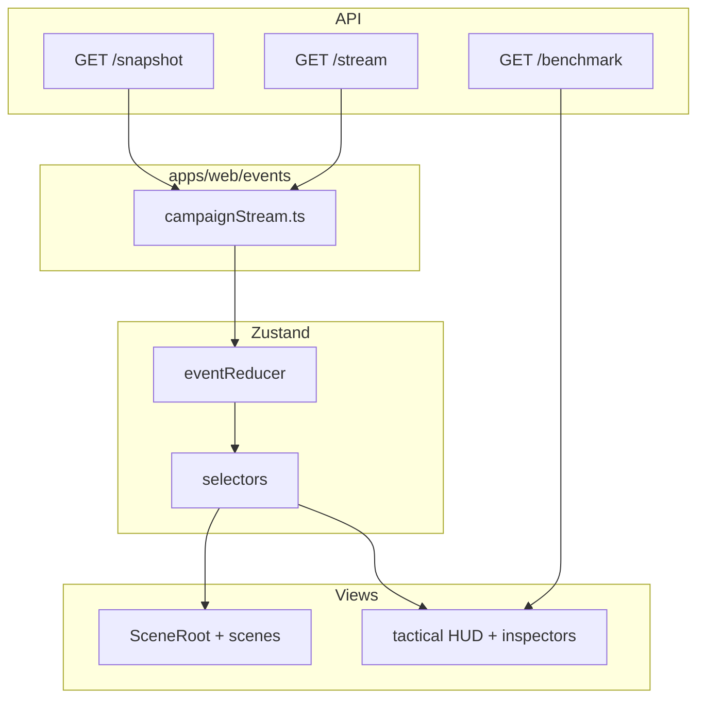

# Tactical 3D UI — Architecture

## Principles

1. **Three tabs only** — `multiverse` | `execution` | `evidence` (`AppMode`).
2. **One canvas** — `GhostCanvas` → `SceneRoot` mounts all scene groups; mode toggles visibility.
3. **Truth path** — snapshot → SSE → `normalizeEnvelope` → `eventReducer` → selectors → R3F + DOM HUD.
4. **No fake progress** — state-based steps; estimates require `estimate_source` or **ESTIMATE UNAVAILABLE**.
5. **Incremental refactor** — tactical components compose existing HUD/inspectors; no parallel store.

## Layer diagram



## Directory layout (target)

```
apps/web/src/
  components/tactical/     # MissionStatus, EventTicker, TacticalHeader, …
  components/dom/          # existing inspectors (reuse)
  hooks/
    useOperationTimer.ts
    useTacticalSelectionUrl.ts
    useRangeBenchmark.ts
  ui/scenes/               # MultiverseScene, ExecutionScene, EvidenceScene
  ui/canvas/               # GhostCanvas, CameraRig, OrbitControls
  events/campaignStream.ts
  state/                   # store, reducer, types, selectors
packages/ui-3d/            # presentation-only primitives
```

## Cross-tab selection

URL query params (Phase 1):

- `tab` — multiverse | execution | evidence
- `world`, `experiment`, `claim`, `run` — entity focus

On change: update `useGhostStore` selection/focus; on store selection: debounced `history.replaceState`.

## HUD composition

| Component | Responsibility |
|-----------|----------------|
| `TacticalHeader` | Wraps brand + mode tabs + mission strip |
| `MissionStatus` | Campaign phase, counts, environment badge |
| `SystemStatus` / `ConnectionStatus` | LIVE / OFFLINE / SIMULATED |
| `StageTimer` | Wall clock + campaign elapsed |
| `EventTicker` | Last N `eventLog` lines, click → focus |
| `CostIndicator` | Accumulated USD when known |
| `InspectorShell` | World / task / worker / evidence panels |

## 3D semantics (shared)

Centralized in `docs/ui/LIVE_STATE_MAPPING.md` and `@ghostrange/ui-3d` status enums. Tactical campaign adds **motion tokens** via CSS `--gr-motion-scale` and optional multiverse orbit drift.

## Backend adapters (planned)

| Need | Reuse first |
|------|-------------|
| World graph | Event-sourced `worlds` + `forks` in snapshot |
| Timing decomposition | `GET /v1/ranges/{id}/benchmark` + extend with operation log |
| Historical P50 | New `timing_history` table or benchmark artifacts under `artifacts/benchmarks/` |
| Telemetry | Vultr/worker agent → SSE `server.metrics` (not yet present) |

## Testing strategy

- Vitest: reducer mapping, timer hooks, URL sync.
- Playwright: extend `ui-final` with tab sync + estimate-unavailable assertions.
- One tactical E2E fixture path (deterministic mock golden path).

## Related docs

- `TACTICAL_UI_AUDIT.md` — classification matrix
- `REALTIME_TIMING_MODEL.md` — field-level contract
- `MULTIVERSE_3D.md`, `EXECUTION_3D.md`, `EVIDENCE_3D.md` — tab specifics
- `THREE_D_ARCHITECTURE.md` — existing M20 3D design
